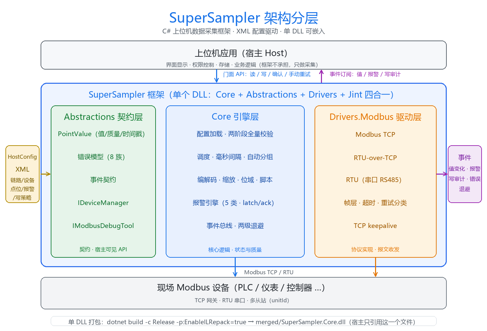

# SuperSampler

**C# .NET Framework 4.6 的上位机数据采集框架**：XML 配置驱动（`HostConfig schemaVersion="3.0"`）、零外部依赖，
把「按配置采集 + 解析成工程值 + 报警 + 写回 + 事件」打包成一个可嵌入的库。宿主只管界面、权限、存储与业务，
通讯调度与数据质量由框架负责。

[](https://github.com/Sarige97/SuperSampler)
[](https://github.com/Sarige97/SuperSampler)
[](LICENSE)
[](docs/测试与验收/验收报告.md)
[](docs/使用说明.md)

---

## 特性

- **XML 配置驱动**：一份 `HostConfig` 文件描述链路 / 设备 / 点位 / 报警 / 写策略；加载期两阶段校验，
  **一次报全所有配置矛盾**，零错误才实例化引擎；配置里的每个字段都有行为，**声明即生效**。
- **全类型解码**：13 种数据类型（uint16/int16/uint32/int32/uint64/int64/float32/float64/string/bcd/datetime/bool/raw）、
  4 种字序（ABCD/BADC/CDAB/DCBA）、位与位域、Scale（linear / 双点 / clamp）、BCD / datetime / 字符串编码、Jint 脚本解码。
- **毫秒级调度**：毫秒轮询间隔 + 地址自动分组 + 块读，散点自动合并成一次通讯，IO 效率可控。
- **断线韧性**：两级退避（设备级 / 链路级）+ TCP keepalive + `RetryDevice` / `RetryLink` 手动重试；
  断线期间不崩不卡，质量回退与恢复全部可见。
- **报警引擎**：high / highHigh / low / lowLow / digital 五种类型，支持 delay / deadband / latch + ack，
  报警触发 / 恢复 / 确认三态事件。
- **写管道四态**：`Succeeded / Failed / Indeterminate / Rejected` + 回读校验（verify）+ 范围 / 类型容量 / 可写区校验；
  联锁与角色权限由宿主负责（框架当前未实现）。
- **事件驱动**：值变化、报警三态、写审计、退避、错误族全部走进程内事件总线（`Inline` / `Queued` 两种投递模式），
  宿主按需订阅，订阅者异常不影响框架。
- **单 DLL 打包**：`dotnet build -c Release -p:EnableILRepack=true` 一键产出
  `bin/Release/net46/merged/SuperSampler.Core.dll`（Core + Abstractions + Drivers + Jint 四合一，宿主只放这一个文件）。

---

## 架构分层



- **上位机应用（宿主）**：界面、权限、存储、业务逻辑——框架**不承担**，宿主通过门面 API 读写、订阅事件。
- **SuperSampler.Abstractions（契约层）**：值模型 / 错误模型 / 事件契约 / 门面接口，宿主可见的最小 API 面。
- **SuperSampler.Core（引擎层）**：配置加载与全量校验、毫秒调度与自动分组、编解码与脚本、报警引擎、事件总线、两级退避。
- **SuperSampler.Drivers.Modbus（驱动层）**：Modbus TCP / RTU / RTU-over-TCP 协议实现（帧层、超时、重试分类、keepalive）。
- **现场设备**：PLC / 仪表 / 控制器等 Modbus 从站，支持 TCP 网关与 RTU 串口多从站。
- **单 DLL**：`Core + Abstractions + Drivers + Jint` 经 ILRepack 合并为一个 `SuperSampler.Core.dll`，宿主只放这一个文件。

## 目录结构

```
SuperSampler/
├── src/
│   ├── SuperSampler.Abstractions/      纯契约:PointValue / 错误 / 事件 / 门面接口
│   ├── SuperSampler.Core/              引擎:配置加载校验 / 调度 / 编解码 / 报警 / 事件总线（含 ILRepack.targets）
│   └── SuperSampler.Drivers.Modbus/    Modbus 驱动（TCP / RTU / RTU-over-TCP）
├── samples/
│   └── InjectionLineMonitor/           net46 Console 示例宿主（全功能演示）
├── assets/
│   └── architecture.png                架构分层图（README 首页用）
├── tests/
│   ├── SuperSampler.UnitTests/         单元测试（1257 例）
│   └── SuperSampler.IntegrationTests/  集成测试（175 例，复杂桩 + 断路器真链路）
└── docs/
    ├── 使用说明.md                      详细使用说明（本 README 的展开版）
    ├── 配置XML说明.md                   配置 XML 逐节点逐字段说明 + 校验规则
    ├── 框架API说明.md                   门面 API（IDeviceManager / IModbusDebugTool）签名与语义
    └── 测试与验收/                      测试计划与验收报告归档
```

---

## 快速开始

### 1. 写一份最小 `HostConfig`

```xml
<?xml version="1.0" encoding="utf-8"?>
<HostConfig schemaVersion="3.0">
  <Global language="zh_CN" timeZone="Asia/Shanghai" nullText="--" swap="word">
    <Polling defaultIntervalMs="1000" requestTimeoutMs="1000"/>
  </Global>
  <Transports>
    <Transport id="plc" variant="tcp" enabled="true" host="127.0.0.1" port="502"
               connectTimeoutMs="2000" requestTimeoutMs="1000"/>
  </Transports>
  <Devices>
    <Device id="PLC-1" name="主PLC" enabled="true" transport="plc" unitId="1" pointSet="MainPoints"/>
  </Devices>
  <PointSets>
    <PointSet id="MainPoints">
      <Defaults area="input" dataType="uint16" swap="none"/>
      <Points>
        <Point id="temp" name="温度" address="0" dataType="int16">
          <Scale factor="0.1"/>
        </Point>
        <Point id="pressure" name="压力" address="10" dataType="uint16" access="readwrite"/>
      </Points>
    </PointSet>
  </PointSets>
</HostConfig>
```

### 2. 接入引擎（最小示例）

```csharp
using SuperSampler.Abstractions.Events;
using SuperSampler.Core.Config;
using SuperSampler.Core.Runtime;

// ① 加载并校验配置（两阶段，一次报全所有矛盾；错误抛 ConfigValidationException）
var config = SamplerConfigLoader.LoadFromXml(@"C:\cfg\host.xml");

// ② 创建引擎
using var engine = new SamplerEngine(config);

// ③ 先订阅、后 Start：引擎一启动就发事件，晚订阅会漏掉第一批
using var sub = engine.Bus.Subscribe<PointValueChangedEvent>(e =>
    Console.WriteLine($"{e.DeviceId}/{e.PointId} = {e.Value}"));

// ④ 启动
engine.Start();

// ⑤ 读值（读缓存，不发通讯，可高频调用）
var detail = engine.GetValueDetail("PLC-1", "temp");   // PointValue: 值 + 质量 + 时间戳
Console.WriteLine($"温度 = {detail.Value}，质量 = {detail.Quality}");

// ⑥ 写值（走完整写管道：范围 / 可写区校验 / 下发 / 回读校验）
var result = await engine.SetValueAsync("PLC-1", "pressure", 150);

// ⑦ 停止（Stop 后不可再 Start，需重建引擎）
engine.Stop();
```

### 3. 看完整示例

- 全功能宿主示例：`samples/InjectionLineMonitor/`（net46 Console，含配置解析摘要、事件落 CSV、轮询显示、操作脚本、断线韧性、退出汇总）
- 详细使用说明：[`docs/使用说明.md`](docs/使用说明.md)

---

## 文档索引

| 文档 | 内容 |
|---|---|
| [docs/使用说明.md](docs/使用说明.md) | 架构与职责边界、环境构建、接入方式、引擎生命周期、读写、事件、报警、错误处理、断线与恢复、单 DLL 打包、已知边界 |
| [docs/配置XML说明.md](docs/配置XML说明.md) | 配置 XML 逐节点逐属性字段说明 + 校验规则 |
| [docs/框架API说明.md](docs/框架API说明.md) | 门面 API（IDeviceManager / IModbusDebugTool）签名与语义 |
| [docs/测试与验收/](docs/测试与验收/) | 测试计划与验收报告归档 |
| [docs/框架用户可见面清单.md](docs/框架用户可见面清单.md) | 配置/API/事件/语义速查基准（维护对照） |
| [docs/审计报告.md](docs/审计报告.md) | 文档审计记录（准确性/覆盖/可读性修正） |

---

## 构建与测试

```bash
# 日常构建（Debug / Release，0 警告 0 错误）
dotnet build SuperSampler.sln -c Debug

# 运行全部测试（单元 1257 + 集成 175 = 1432 例，全绿）
dotnet test SuperSampler.sln

# 单 DLL 打包（Core + Abstractions + Drivers.Modbus + Jint 四合一）
dotnet build src/SuperSampler.Core/SuperSampler.Core.csproj -c Release -p:EnableILRepack=true
# 产物：src/SuperSampler.Core/bin/Release/net46/merged/SuperSampler.Core.dll

# 构建示例宿主
dotnet build samples/InjectionLineMonitor/InjectionLineMonitor.csproj -c Debug
```

> 说明：`Microsoft.NETFramework.ReferenceAssemblies` 包仅在构建期使用（无 VS 的机器也能编译 net46），不随产物发布。

---

## 许可

MIT License。作者：Sarige97（© 2026）。本仓库附带 `LICENSE` 文件。
